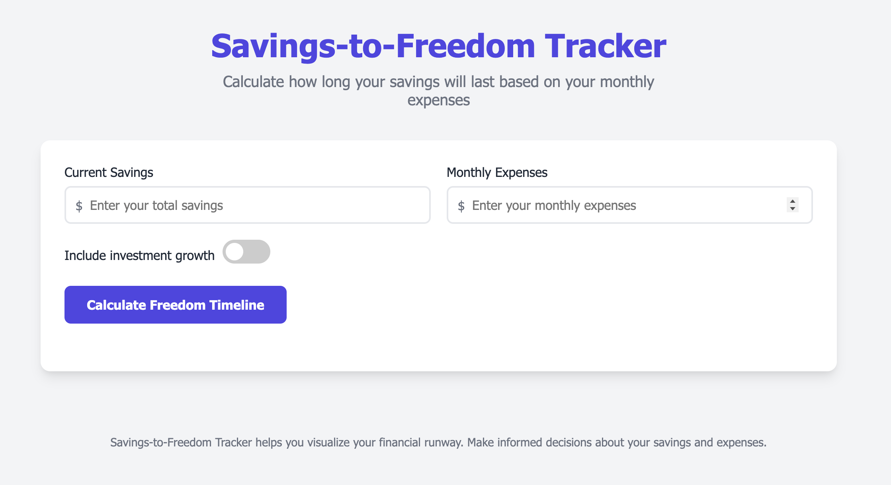

# Savings-to-Freedom Tracker

A responsive web application that helps users visualize how long their savings will last based on monthly expenses.



View here: [Savings-to-Freedom Tracker](https://yellowparenti.github.io/savings-to-freedom-tracker/)

## Overview

The Savings-to-Freedom Tracker is a financial planning tool that calculates and visualizes a user's financial runway. By inputting current savings and monthly expenses, users receive a clear timeline showing how long they can sustain their lifestyle without additional income.

## Features

- **Simple Financial Projection:** Calculate how many months and years your savings will last
- **Investment Return Modeling:** Option to include investment growth with customizable annual return rates
- **Visual Timeline:** Interactive chart showing projected savings balance over time
- **Detailed Breakdown:** View key metrics including freedom date and burn rate
- **Responsive Design:** Seamlessly works on desktop, tablet, and mobile devices

## How It Works

1. **Input Your Data:**
   - Enter your current total savings
   - Enter your monthly expenses

2. **Configure Options:**
   - Toggle whether to include investment growth
   - If enabled, set your expected annual return percentage

3. **View Results:**
   - See months and years of financial freedom
   - View projected balance decline through the interactive chart
   - Get detailed breakdown including freedom date

## Technical Details

### Technologies Used

- HTML5
- CSS3
- JavaScript (ES6+)
- Chart.js for data visualization

### Key Implementation Details

- Responsive design using CSS Grid and Flexbox
- Interactive data visualization with Chart.js
- Month-by-month calculation accounting for compound investment returns
- Modern UI with clean, user-friendly design
- Form validation with error handling

## Installation

This application is client-side only and doesn't require any special installation. Simply download the HTML file and open it in any modern web browser.

```bash
# Clone the repository
git clone https://github.com/yourusername/savings-freedom-tracker.git

# Navigate to the project directory
cd savings-freedom-tracker

# Open index.html in your browser
```

## Usage Examples

### Basic Usage

Input your current savings (e.g., $50,000) and monthly expenses (e.g., $2,500) to calculate how long your money will last without any investment growth.

### With Investment Returns

Enable the "Include investment growth" toggle and set an expected annual return (e.g., 7%) to see how investment growth extends your financial runway.

## Assumptions and Limitations

- Calculations assume consistent monthly expenses
- No additional income is considered during the freedom period
- Investment returns are applied monthly at a constant rate
- The app caps projections at 50 years (600 months)

## Customization

The app can be easily customized:

- Modify the CSS variables in the `:root` selector to change the color scheme
- Adjust the chart options in the `updateChart` function to change visualization settings
- Edit the assumptions text to reflect different calculation parameters

## License

MIT License - Feel free to use, modify, and distribute this code for personal or commercial projects.

## Contributing

Contributions are welcome! Feel free to open issues or submit pull requests to improve the application.

## Future Enhancements

- Add ability to account for expected inflation
- Include additional income streams in calculations
- Save configurations in local storage
- Add multiple scenario comparison feature
- Export results as PDF or CSV
